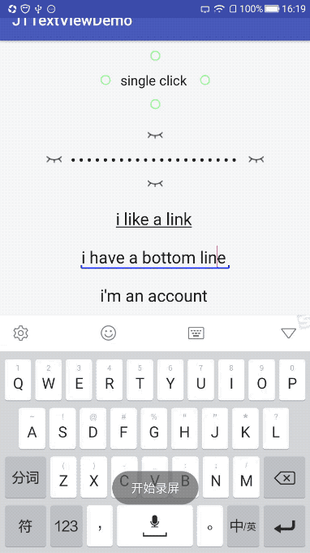

# JTTextView

   [](./LICENSE)

JTTextView是一个Android的EditText扩展，集成了较多的功能，简单易用，免去了开发很多的工作量。


 

注意：由于Android密码框明文显示也是受保护的，所以再录制明文显示时会黑屏，而实际真机调试并不会！推荐自己下载demo真机跑一下😊

## 功能

1. 四个方向的图标在点击时可自动替换，并且有相应的回调listener。
2. 可随焦点改变自动显示/隐藏图标。
3. 具备「点选」「点松」两种模式。
4. 解决了Android文字下划线麻烦的问题。
5. 两种文字托盘样式，可高度自定义。
6. 表单验证及自动填充（sames as AutoCompleteTextView)

## 集成

```groovy
implementation 'com.william:JTTextView:1.0.0'
```

## 使用

### in layout

```xml
<com.william.jttextview.JTTextView
        android:id="@+id/jt_text_view"
        android:layout_width="wrap_content"
        android:layout_height="wrap_content"
        android:drawablePadding="10dp"
        android:drawableLeft="@drawable/none"
        app:drawableStart_action="@drawable/yes"
        android:drawableTop="@drawable/none"
        app:drawableTop_action="@drawable/yes"
        android:drawableRight="@drawable/none"
        app:drawableEnd_action="@drawable/yes"
        android:drawableBottom="@drawable/none"
        app:drawableBottom_action="@drawable/yes"
        android:text="single click" />
```

### In kotlin

```kotlin
jt1.setOnDrawableClickListener { switchState, view, actionId, currentText ->

            val str = when (actionId) {
                JTTextView.ACTION_START -> "left drawable"
                JTTextView.ACTION_TOP -> "top drawable"
                JTTextView.ACTION_END -> "right drawable"
                else -> "bottom drawable"
            }

            val test = if (switchState) "selected $str" else "give up $str"

            Toast.makeText(this, str, Toast.LENGTH_SHORT).show()
        }
        
jt5.validator = object : JTTextView.Validator {
            override fun isValid(text: CharSequence?): Boolean {
                return when {
                    text == null -> false
                    text.isEmpty() -> {
                        Toast.makeText(this@MainActivity, "please input your account !", Toast.LENGTH_SHORT).show()
                        false
                    }
                    text.length > 6 -> {
                        Toast.makeText(this@MainActivity, "your account's length is longer then 6 !", Toast.LENGTH_SHORT).show()
                        false
                    }
                    else -> true
                }
            }

            //autoComplete
            override fun fixText(invalidText: CharSequence?) = invalidText

        }
```

### in Java

```java
It's looks like kotlin ：）
```


## attr属性一览

|ATTR|TYPE|defaultValue|EFFECT|
|------|---------|---------|---------|
|drawableStart_action|drawable|none|点击时展示的左图标|
|drawableTop_action|drawable|none|点击时展示的上图标|
|drawableEnd_action|drawable|none|点击时展示的右图标|
|drawableBottom_action|drawable|none|点击时展示的下图标|
|autoReset|boolean|false|是否自动重置（手指点击触发，抬起则重置，参考demo密码明文显示）|
|autoDisplay|boolean|false|失去焦点时自动隐藏|
|underLine|boolean|false|是否显示文字下划线（颜色随文字颜色）|
|bottomLine|boolean|false|是否显示文字托盘，false则其他托盘设置均失效|
|bottomLineColor|color||托盘颜色|
|bottomLineFocusColor|color|bottomLineColor|托盘聚焦颜色|
|bottomLineStroke|float||托盘线条粗细|
|bottomLineFocusStroke|color|bottomLineStroke|托盘聚焦线条粗细|
|bottomLineStyle|color|line/wall|托盘样式，line:直线   wall:城墙（两端出头）|

## 未来想加入的功能

1. 多行文字在中间用...缩略（Android目前只支持单行文字在中间缩略）
2. 加入多种托盘样式
3. 还想要自行车？你说要那种？请提issues。

## JT是什么意思？

JT是江豚的缩写，我希望我写的每一个开源框架，在给大家带来便利的同时，也让大家了解到长江江豚这种**天生就会微笑直到濒危**的可爱动物。

[长江江豚](http://www.njyfpca.org/about/?111.html)


## License

    Copyright 2018 william Inc.

    Licensed under the Apache License, Version 2.0 (the "License");
    you may not use this file except in compliance with the License.
    You may obtain a copy of the License at

       http://www.apache.org/licenses/LICENSE-2.0

    Unless required by applicable law or agreed to in writing, software
    distributed under the License is distributed on an "AS IS" BASIS,
    WITHOUT WARRANTIES OR CONDITIONS OF ANY KIND, either express or implied.
    See the License for the specific language governing permissions and
    limitations under the License.